# Key Features & Functional Modules

> **Status**: [VERIFIED]  
> **Source Baseline**: `src/components/`, `src/lib/`, `api/gemini/`  
> **Audience**: Product Managers, Developers, and QA Engineers  

---

## 1. Feature Map

```mermaid
graph TD
    Root["Cognify 2.0 Feature Ecosystem"] --> C["Adaptive Mentorship & Chat"]
    Root --> D["Universal Disability Hub"]
    Root --> A["Academic Command Center"]
    Root --> F["French Travel Assistant"]
    Root --> S["Admin & Security Hub"]

    C --> C1["11-Language Dialect Mirroring"]
    C --> C2["Formative Micro-Checks (:::micro-check)"]
    C --> C3["SM-2 Retention Warmup Banner"]
    C --> C4["Epistemic Pedagogy Badge"]

    D --> D1["Vision Companion (Hazards & OCR)"]
    D --> D2["Spatial Object Memory"]
    D --> D3["Motor Euphonia (FaceMesh & Dwell)"]
    D --> D4["Vocal Pitch Triggers (FFT)"]
    D --> D5["Sign Video Studio & 3D Avatar"]
    D --> D6["Two-Way Hearing Bridge"]

    A --> A1["GPA Calculator (4.0 & 5.0 scales)"]
    A --> A2["What-If Simulation Sandbox"]
    A --> A3["Academic Planner & Exam Countdown"]
    A --> A4["Goal Tracker & Subtasks"]
    A --> A5["Cognitive Gym & Decoupled IQ"]

    F --> F1["French Cultural Etiquette Prompting"]
    F --> F2["Arabic & English Transliteration"]
    F --> F3["Emergency Services Quick-Dial"]

    S --> S1["Frankfurt Latency & Quota Guard"]
    S --> S2["DevTools Intrusion Tracker"]
    S --> S3["Automated System JSON Backup"]
```



---

## 2. Detailed Functional Breakdown [VERIFIED]

### A. Adaptive Mentorship & Chat Engine (`ChatInterface.tsx`, `ai.ts`)
1. **Multilingual Dialect Mirroring**:
   - Seamlessly mirrors student dialect: Egyptian Arabic (`العامية المصرية`), Modern Standard Arabic (`الفصحى`), English, French, Spanish, German, Italian, Portuguese, Russian, Chinese, Japanese.
2. **Formative Micro-Checkups (`:::micro-check`)**:
   - Interactive widgets parsed on the fly from custom markdown delimiters:
     ```json
     :::micro-check
     {
       "question": "What happens when you dereference a null pointer in C++?",
       "conceptId": "pointers",
       "options": ["Compiles with warning", "Segmentation fault / Undefined Behavior", "Returns 0", "Allocates memory"],
       "correctIndex": 1,
       "explanation": "Dereferencing a null pointer attempts to access invalid memory (address 0x0), crashing the process."
     }
     :::
     ```
   - Features 1-click execution, millisecond response timer, and instant feedback.
3. **Spaced Retention Warmup Banner (`RetentionWarmupBanner.tsx`)**:
   - Queries SM-2 schedules on chat mount. If a concept's review timestamp has elapsed, presents a high-urgency "30-Second Retention Challenge" to reinforce memory before the Ebbinghaus decay curve steepens.
4. **Epistemic Pedagogy Badge**:
   - Displays an illuminated badge above AI responses indicating the active pedagogical strategy (e.g. `worked_example`, `analogies`, `socratic`) and the transparent rationale behind why the system adapted.

---

### B. Universal Disability Hub (`DisabilityModeView.tsx`)
Designed with **Strict Hardware Lifecycle Isolation** to prevent camera/mic resource locking:

1. **Vision Companion (`VisionCompanionView.tsx`)**:
   - 30fps camera feed sampled on-demand into canvas frame snapshots.
   - **Hazards-First Safety Triage**: The AI system prompt mandates announcing physical threats (steps, obstacles, vehicles, hot surfaces, spills) before any descriptive aesthetic details.
   - **OCR Verbatim**: Reads price tags, expiration dates, medicine dosages, and street signs with literal precision.
   - **Spatial Physical Memory (`SpatialObjectRecord`)**: Remembers where the user set down physical belongings (keys, prescription glasses, medication) with timestamp and room coordinates.
2. **Motor Euphonia View (`MotorEuphoniaView.tsx`)**:
   - Designed for users with ALS, quadriplegia, or tremor disorders.
   - **Face Tracking**: MediaPipe FaceMesh tracks 468 landmarks; nose-tip vector translates to mouse cursor coordinates.
   - **Dwell Clicking**: Hovering over a card or key for 800ms triggers selection automatically.
   - **Blink & Smile Gestures**: Deliberate eye blinks and smiles serve as alternative physical switches.
   - **Vocal Sound Triggers**: WebAudio AnalyserNode computes real-time FFT pitch autocorrelation (120–250 Hz humming tones) for hands-free audio selection.
   - **Single-Switch Auto-Scanning**: Row-column scanning over Arabic/English virtual keyboards for users with limited head mobility.
3. **Sign Video Studio & 3D Avatar (`SignVideoStudio.tsx`, `SignAvatar3D.tsx`)**:
   - Tracks 21 3D hand joints with MediaPipe Hands.
   - Local TensorFlow.js classifier runs on WebGL, identifying alphabet letters and gestures locally with 0 video transmission.
   - Three.js skeletal avatar translates incoming spoken or typed text into natural sign gestures.
4. **Two-Way Hearing Bridge (`TwoWayHearingBridge.tsx`)**:
   - Real-time communication bridge: transforms spoken audio from hearing participants into large typography and sign avatar motions, while translating sign gestures and typed responses into speech synthesis.

---

### C. Academic Command Center (`AcademicCommandCenter.tsx`)
1. **GPA Calculator (`GpaCalculator.tsx`)**:
   - Supports 4.0 and 5.0 GPA scales as well as Egyptian credit-hour grading.
   - Safely handles zero-credit course edge cases without division-by-zero errors.
   - **What-If Simulation Sandbox**: Allows testing hypothetical future grades in an isolated sandbox state that never corrupts permanent course transcripts.
2. **Academic Planner (`AcademicPlanner.tsx`)**:
   - Weekly semester schedule organizer with live countdown timers for midterm and final exams.
   - Prerequisite dependency trees preventing course registration before foundational credits are fulfilled.
3. **Goal Tracker (`Goaltracker.tsx`)**:
   - Breaks long-term academic milestones into measurable subtasks with progress bars and milestone rewards.
4. **Cognitive Gym & Decoupled IQ (`CognitiveGym.tsx`, `IqAssessmentModal.tsx`)**:
   - Daily cognitive exercises targeting logic, arithmetic, spatial orientation, memory, and linguistic agility with streak mechanics.
   - Scientifically modeled IQ assessment across 5 cognitive subdomains, strictly decoupled from classroom curriculum difficulty.

---

### D. French Travel Voice Assistant (`FrenchTravelVoiceAssistant.tsx`)
- Specialized travel companion calibrated for navigating France.
- Enforces French cultural politeness protocols (starting every interaction with *Bonjour Madame/Monsieur* and ending with *Merci beaucoup*).
- Bilingual phonetic guides: Arabic transliteration (النطق الصوتي بالعربية) and English phonetics for authentic pronunciation.
- Instant emergency dialer for French emergency numbers (SAMU: 15, Police: 17, Pompiers: 18).

---

### E. Super Admin & Security Hub (`AdminDashboard.tsx`, `DatabaseHub.tsx`)
- **Frankfurt Datacenter Health**: Monitors latency directly to `europe-west1` and displays real-time Firestore operations metrics to prevent exceeding Spark free-tier quotas.
- **Intrusion Tracker (`securityTracker.ts`)**: Intercepts keyboard shortcuts for browser DevTools (`F12`, `Ctrl+Shift+I/J/C`, `Cmd+Option+I`), detects console tampering, and logs incident telemetry into the `securityAudits` collection.
- **Role-Based Access Control (RBAC)**: Supports roles (`Student`, `Special Needs`, `Graduation Project`, `Org Manager`, `Admin`, `Super Admin`) with immutable lockout protection for founders.
