# System Context & External Integrations

> **Status**: [VERIFIED]  
> **Source Baseline**: `api/_lib/ai.ts`, `api/_lib/router.ts`, `src/lib/firebase.ts`, `src/main.tsx`  
> **Audience**: Systems Engineers, Security Engineers, and Integrators  

---

## 1. System Boundary Diagram

```mermaid
flowchart TB
    subgraph Client ["Client Tier (Browser / PWA)"]
        Browser["React 19 Frontend<br>(PWA Standalone)"]
        TFJS["TensorFlow.js / WebGL<br>(Sign Classifier)"]
        MP["MediaPipe<br>(FaceMesh & Hands)"]
        WA["WebAudio API<br>(FFT Pitch Analysis)"]
        LS[("Encrypted LocalStorage<br>(AES-GCM 256-bit)")]
    end

    subgraph Edge ["Serverless Gateway (Vercel / Node.js)"]
        GW["Express / Vercel Functions<br>(/api/gemini/*, /api/telemetry/*)"]
        Guard["AuthGuard (JWT Verification)<br>& Dual-Tier Rate Limiter"]
        Router["Deterministic Router<br>(Pure Function)"]
        Quality["QualityGuard<br>(Auto-Repair & Sanitizer)"]
    end

    subgraph AI_Providers ["External LLM Providers"]
        Gemini["Google Gemini 2.5 Flash<br>(Multimodal / Primary Text)"]
        NVIDIA["NVIDIA NIM API<br>(GLM-5.2 / DeepSeek-R1)"]
        Groq["Groq Cloud API<br>(Llama 3.3 70B Versatile)"]
        XAI["xAI API<br>(Grok-2 Latest)"]
    end

    subgraph Cloud_Data ["Google Cloud / Firebase Platform"]
        FAuth["Firebase Authentication<br>(Google OAuth / Identity)"]
        FS[("Cloud Firestore<br>(europe-west1 / Frankfurt)")]
    end

    subgraph Monitoring ["Observability & Performance"]
        Sentry["Sentry Error Tracking"]
        VercelSI["Vercel Speed Insights & Analytics"]
    end

    Browser <-->|WebRTC / Video / Audio| MP & WA & TFJS
    Browser <-->|Sync 0ms| LS
    Browser -->|HTTPS POST + Bearer JWT| Guard
    Guard --> Router --> GW
    GW <-->|REST / SSE Streaming| Gemini & NVIDIA & Groq & XAI
    GW --> Quality --> Browser

    Browser <-->|OAuth / Identity| FAuth
    Browser <-->|Debounced Dot-Path 5s| FS
    Browser -.->|Exceptions| Sentry
    Browser -.->|CWV Metrics| VercelSI
```

---

## 2. External Service Catalog & Contracts [VERIFIED]

### 1. Google Gemini API (`@google/genai`)
- **Models**: `gemini-2.5-flash`, `gemini-2.5-flash-lite`, `gemini-flash-latest` (`api/_lib/ai.ts:51`).
- **Primary Role**: High-speed conversational mentoring, default prompt execution, and multimodal visual analysis (reading camera snapshots, textbook screenshots, and documents).
- **Protocol**: HTTPS REST (`generateContent`) and Server-Sent Events (`streamGenerateContent?alt=sse`).
- **Secret Isolation**: Kept strictly server-side in `process.env.GEMINI_API_KEY`. Rotated automatically upon encountering HTTP 429/503.

### 2. NVIDIA NIM API
- **Models**: `z-ai/glm-5.2`, `deepseek-ai/deepseek-r1`, `meta/llama-3.3-70b-instruct` (`api/_lib/ai.ts:68`).
- **Primary Role**: Deep logical deduction, code generation, refactoring, and debugging complex runtime exceptions.
- **Failover Trigger**: Invoked first for tasks classified as `reasoning`. Internal `<think>...</think>` tags are stripped via `stripReasoning()` before reaching the client.
- **Protocol**: OpenAI-compatible endpoint `https://integrate.api.nvidia.com/v1/chat/completions`.

### 3. Groq Cloud API
- **Models**: `llama-3.3-70b-versatile`, `llama-3.1-8b-instant` (`api/_lib/ai.ts:93`).
- **Primary Role**: Ultra-low latency fallback layer (LPU inference) for quick concept queries and rapid feedback cycles.
- **Protocol**: OpenAI-compatible endpoint `https://api.groq.com/openai/v1/chat/completions`.

### 4. xAI (Grok) API
- **Model**: `grok-2-latest` (`api/_lib/ai.ts:85`).
- **Primary Role**: 4th-tier disaster resilience fallback guaranteeing 99.99% system availability when Google, NVIDIA, and Groq experience concurrent rate limits or regional outages.
- **Protocol**: OpenAI-compatible endpoint `https://api.x.ai/v1/chat/completions`.

### 5. Firebase Authentication & Cloud Firestore
- **Location**: `europe-west1` (Frankfurt datacenter) (`src/lib/databaseHub.ts:31`).
- **Auth Protocols**: Google OAuth 2.0 and email/password tokens verified server-side via RS256 public keys.
- **Database Schema**: Document subcollections under `users/{uid}/studentState/current`, `users/{uid}/chatThreads`, and global `securityAudits`.
- **Throttling Policy**: Synchronous in-memory caching combined with 5000ms debounced writes to conform strictly to Firebase Spark free tier quotas (50k daily reads, 20k daily writes).

### 6. Sentry & Observability
- **Integration**: `@sentry/react` initialized conditionally in production (`src/main.tsx`).
- **Filter Guard**: Configured with a `BENIGN` regex filter ignoring benign browser errors (`ResizeObserver loop`, `AbortError`, `vercel.live`, `chrome-extension`).

---

## 3. Trust & Security Boundaries [VERIFIED]

1. **Client to Serverless Boundary**: The browser never communicates directly with LLM providers using hardcoded keys. All AI queries pass through `/api/gemini/*` guarded by `verifyRequestAuth` (strict JWT validation) and IP/User rate limiters.
2. **Media Boundary**: No video frames or raw audio recordings are transmitted to or stored on the backend. Computer vision and audio pitch extraction are 100% computed client-side in RAM via MediaPipe and WebAudio FFT.
3. **Multi-Tenant Boundary**: Firestore security rules restrict reading/updating user documents strictly to the authenticated `request.auth.uid`. Academic institutions and mentors can only access aggregated cohort statistics.
