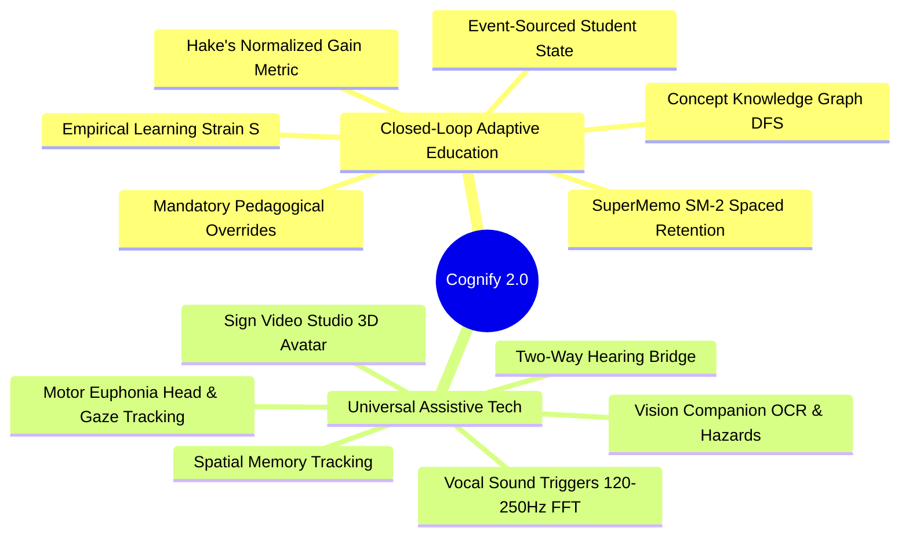

# System Overview: Cognify 2.0

> **Status**: [VERIFIED]  
> **Source Baseline**: `Mahmoud-Hashim-pro/cognify-production` on branch `main`  
> **Repository Commit**: `81c9790`  
> **Audience**: Software Engineers, Architects, and New Contributors  

---

## 1. Executive Summary

**Cognify 2.0** is an intelligent, privacy-first, adaptive learning and assistive platform engineered by **The Cognify Development Team** as an elite graduation project. The platform combines modern edge computing, cognitive neuroscience, and real-time generative AI to deliver personalized education while breaking down physical barriers for people of determination (individuals with visual, vocal, motor, or auditory impairments).

Unlike conventional ed-tech platforms that offer static content catalogs or generic chatbot wrappers, Cognify implements a **mathematically modeled closed-loop adaptive pedagogical cycle**: it continuously diagnoses student comprehension, detects cognitive strain, diagnoses missing prerequisites via a recursive knowledge graph, and dynamically forces the AI mentor into specific pedagogical styles (e.g. physical analogies, worked examples with RAM-level memory reasoning, and 1-click micro-checks).

---

## 2. The Dual Core Pillars

### Pillar 1: Closed-Loop Adaptive Education [VERIFIED]
- **Empirical Learning Strain**: Evaluated dynamically based on real-time latency ($>15\text{s}$) and consecutive errors ($N \ge 2$).
- **Prerequisite Gap Diagnosis**: Recursive depth-first search (DFS) traversing unmastered ancestor concepts when a student struggles with complex topics (e.g. tracing pointer dereferencing before dynamic memory).
- **Mandatory Pedagogical Directives**: When an intervention is active, the system injects strict, non-negotiable operational directives into the AI system prompt (`buildPersona`), forcing it into structured remediation rather than generic cheerleading.
- **Formative Micro-Checkups**: Automated 1-click interactive assessment widgets (`:::micro-check`) verifying immediate concept absorption.

### Pillar 2: Universal Assistive Technology [VERIFIED]
- **Vision Companion**: 30fps camera frame ingestion, hazards-first audio triage, OCR text extraction, and persistent spatial tracking of physical objects (`SpatialObjectRecord`).
- **Motor Euphonia**: Hands-free computing for users with ALS, quadriplegia, or cerebral palsy using MediaPipe FaceMesh (468 facial landmarks), nose-tip vector tracking, 800ms dwell click, eye blink triggering, and WebAudio FFT pitch autocorrelation (120–250 Hz humming).
- **Sign Video Studio & 3D Avatar**: Real-time sign language recognition using MediaPipe Hands (21 3D points) and local WebGL TensorFlow.js models, coupled with a Three.js skeletal avatar translating spoken/written words into sign language.
- **Two-Way Hearing Bridge**: Bidirectional real-time translation allowing a deaf student and a hearing teacher/peer to converse naturally.

---

## 3. The Decoupling Invariant [VERIFIED]

A foundational architectural rule governing Cognify is the **Strict IQ Decoupling Law**:
> **Invariant**: A student's scientific IQ assessment score (`iqScore`) is strictly decoupled from their academic grade level (`profile.level`) and curriculum track.

The IQ test assesses baseline cognitive dimensions (Spatial, Numerical, Verbal, Memory, Logic), while academic progression is managed entirely dynamically through the event-sourced `StudentState` engine based on observed mastery, retention intervals, and performance. A student is never gated or restricted from advanced materials by an immutable score.

---

## 4. Primary Personas & Access Pathways [VERIFIED]

| Persona / Role | Target User | Entrypoint & Experience | Key Architectural Features |
| :--- | :--- | :--- | :--- |
| **Student** | High school and university students | `/` (Adaptive Chat & Academic Command Center) | Concept mastery tracking, SM-2 retention warmup, GPA calculator, Academic planner. |
| **People of Determination** | Individuals with visual, motor, or hearing disabilities | `/disability` (Disability Hub) | Isolated camera/mic lifecycle, hands-free dwell navigation, OCR verbatim, 3D avatar. |
| **Faculty & Mentors** | Academic advisors & teachers | `/cohort` (Institution Cohort Hub) | Aggregated cohort metrics, Bloom distribution, struggle heatmaps (Zero access to private chat text). |
| **System Administrator** | Platform operators | `/admin` (Super Admin & Database Hub) | Frankfurt latency monitor, Firestore Spark quota guard, security audit logs, user management. |
| **Guest** | First-time visitors / evaluation reviewers | Instant temporary session | Pure in-memory / LocalStorage state, 0% cloud writes, non-persistent telemetry. |
