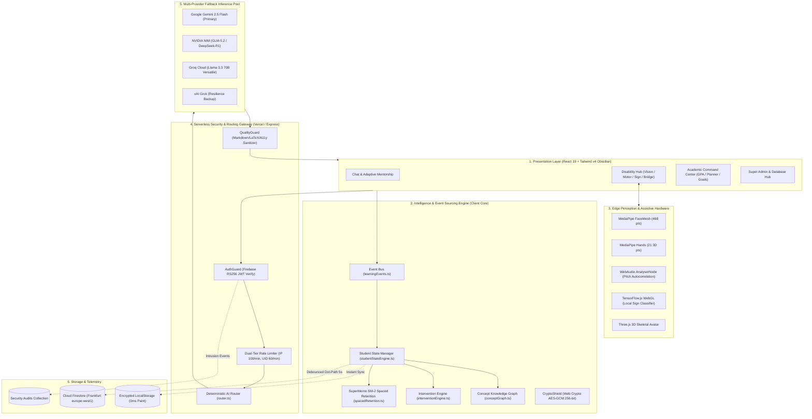

# Architecture Overview

> **Status**: [VERIFIED]  
> **Source Baseline**: Full codebase topology  
> **Audience**: Software Architects, Tech Leads, and Senior Developers  

---

## 1. High-Level Layered Architecture

Cognify 2.0 is structured as a **Layered Clean Architecture** enforcing **Unidirectional Data Flow** and strict physical/logical isolation between browser client execution and server-side secret management.

---

## 2. Architectural Layers & Separation of Concerns [VERIFIED]

### Layer 1: Presentation Tier
- **Framework**: React 19 (`react@19.0.0`, `react-dom@19.0.0`) with TypeScript strict mode.
- **Design System**: Dark Obsidian Glassmorphic palette (`#0A0C14`, `#121524`, frosted slate borders, and subtle cyan/indigo glows).
- **Core Views**:
  - `ChatInterface.tsx`: Central conversational hub with markdown, LaTeX math, code highlighting, and `:::micro-check` interactive components.
  - `DisabilityModeView.tsx`: Sub-hub switching between Vision Companion, Motor Euphonia, and Sign Studio with hardware lifecycle isolation.
  - `AcademicCommandCenter.tsx`: Unified container for GPA calculator, semester planner, goal tracker, and cognitive gym.
  - `AdminDashboard.tsx`: High-privilege control center for system diagnostics, database health, and security telemetry.

### Layer 2: Intelligence & State Engine
- **Single Source of Truth**: `StudentStateManager` (`src/lib/studentStateEngine.ts`).
- **Pattern**: Event Sourcing. State changes are driven by strongly-typed event dispatches (`EXERCISE_ANSWERED`, `FEEDBACK_RECORDED`, `CONVERSATIONAL_STRAIN`).
- **Mathematical Formulations**:
  - **Empirical Learning Strain**: $S = \min(1.0, \text{latencyWeight} + \text{errorWeight})$.
  - **SuperMemo SM-2 Interval Progression**: $EF' = EF + (0.1 - (5 - q) \times (0.08 + (5 - q) \times 0.02))$.
  - **Hake's Normalized Learning Gain**: $g = \frac{\text{Post} - \text{Pre}}{100 - \text{Pre}}$.

### Layer 3: Edge Perception & Hardware Tier
- **Media Processing**: Purely zero-knowledge client-side processing in RAM.
- **Components**:
  - Camera frames are ingested via WebRTC `getUserMedia()` and fed into Google MediaPipe WebAssembly runtimes.
  - Audio signals are processed through native `AudioContext` and `AnalyserNode` for frequency-domain pitch estimation (120–250 Hz autocorrelation).
  - WebGL hardware acceleration powers TensorFlow.js inference and Three.js 3D avatar skeletal rigging.

### Layer 4: Serverless Security & AI Gateway
- **Runtime**: Node.js / Vercel Serverless Functions (`api/gemini/*.ts`, `api/telemetry/*.ts`).
- **Security Envelope**:
  1. `verifyRequestAuth`: Rejects unauthenticated requests with HTTP 401; verifies RS256 Firebase ID tokens.
  2. `checkRateLimit`: Dual-tier sliding window defense enforcing 100 req/min per IP and 60 req/min per user UID.
  3. `router.ts`: Deterministic classification into `fast`, `reasoning`, or `vision` tasks.
  4. `qualityGuard.ts`: Sanitizes responses, fixes unclosed code fences and LaTeX tags, and strips harmful formatting for screen readers.

### Layer 5: Multi-Provider Inference Pool
- Orchestrates failover across four independent cloud LLM infrastructures:
  $$\text{Gemini 2.5} \longleftrightarrow \text{NVIDIA NIM} \longleftrightarrow \text{Groq Cloud} \longleftrightarrow \text{xAI}$$
- Rotates provider keys on HTTP 429/503 and streams response chunks over Server-Sent Events (SSE).

### Layer 6: Persistence Tier
- **Dual-Tier Cache**: In-memory and AES-GCM encrypted LocalStorage provide instant UI updates (0ms delay).
- **Remote Cloud**: Debounced 5000ms dot-path updates to Cloud Firestore in Frankfurt (`europe-west1`), conserving Firebase Spark free-tier quotas.
