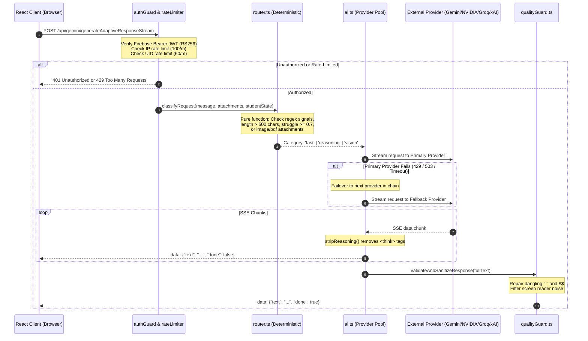

# Backend Architecture & Serverless Gateway

> **Status**: [VERIFIED]  
> **Source Baseline**: `api/_lib/`, `api/gemini/`, `server.ts`, `server/routes.ts`  
> **Audience**: Backend Engineers, DevOps, and Security Auditors  

---

## 1. Dual Deployment Architecture [VERIFIED]

Cognify provides a dual-runtime backend architecture:
1. **Production Serverless Gateway**: Deployed on Vercel as modular Serverless Functions (`api/gemini/*.ts`, `api/telemetry/*.ts`).
2. **Local Development & Standalone Server**: An Express server compiled via `esbuild server.ts --bundle --platform=node --format=cjs --packages=external --minify --outfile=dist/server.cjs`.



---

## 2. The Gateway Security Envelope (`guard()`) [VERIFIED]

All requests entering `/api/gemini/*` must pass through the shared `guard(req, res)` pipeline defined in [`api/_lib/ai.ts:616`](file:///C:/Users/Tie/.gemini/antigravity/scratch/AI-Powered-Adaptive-Personal-Assistant/AI-Powered-Adaptive-Personal-Assistant-main/api/_lib/ai.ts):

### Step 1: Method Gating
Rejects non-POST requests with HTTP 405 Method Not Allowed.

### Step 2: Strict Authentication Verification (`authGuard.ts`)
```ts
// api/_lib/authGuard.ts
const auth = await verifyRequestAuth(req);
if (!auth.authenticated || !auth.uid) {
  res.status(401).json({ error: 'Authentication required. Please sign in.' });
  return false;
}
```
Verifies standard Firebase ID tokens cryptographically against Google's public key certificate bundle. Unauthenticated attempts or forged `body.uid` payloads are strictly rejected.

### Step 3: Provider Key Health Check
Ensures that at least one valid key exists across `GEMINI_API_KEY`, `NVIDIA_API_KEY`, `GROQ_API_KEY`, or `XAI_API_KEY`. If none are configured, responds with HTTP 503.

### Step 4: Dual-Tier Sliding-Window Rate Limiting (`rateLimiter.ts`)
```ts
// Tier 1: IP-Level DDoS & Scraper Defense
const ipRate = checkRateLimit(`ip:${clientIp}`, 100); // 100 req / 60s
res.setHeader('X-RateLimit-Limit-IP', '100');
res.setHeader('X-RateLimit-Remaining-IP', String(ipRate.remaining));

// Tier 2: User-Level Account Defense
const userRate = checkRateLimit(`user:${auth.uid}`, 60); // 60 req / 60s
res.setHeader('X-RateLimit-Limit-User', '60');
res.setHeader('X-RateLimit-Remaining-User', String(userRate.remaining));
```
When limits are breached, sets the `Retry-After` header and returns HTTP 429.

---

## 3. Secret Isolation & Key Rotation [VERIFIED]

> **Contradiction Surfaced & Resolved**:  
> *Legacy documentation*: Stated that client-side components could use `VITE_GEMINI_API_KEY`.  
> *Actual implementation*: Completely decoupled. In production, keys are stored solely in server environment variables (`GEMINI_API_KEY`, `NVIDIA_API_KEY`, `GROQ_API_KEY`, `XAI_API_KEY`) without the `VITE_` prefix, preventing Vite from ever bundling them into browser JavaScript.

### Key Pooling & Rotation
Environment variables support multiple comma-separated or space-separated keys:
```ts
const splitKeys = (raw?: string): string[] =>
  (raw || '').split(/[,\s]+/).map((k) => k.trim()).filter(Boolean);

export const GEMINI_KEYS = () => splitKeys(process.env.GEMINI_API_KEY);
export const NVIDIA_KEYS = () => splitKeys(process.env.NVIDIA_API_KEY);
export const GROQ_KEYS = () => splitKeys(process.env.GROQ_API_KEY);
export const XAI_KEYS = () => splitKeys(process.env.XAI_API_KEY);
```
During a request, the server rotates through all keys in the pool upon receiving HTTP 429 or 503 before escalating to the next fallback provider.

---

## 4. Response Sanitization & Quality Guard [VERIFIED]

Located in [`api/_lib/qualityGuard.ts`](file:///C:/Users/Tie/.gemini/antigravity/scratch/AI-Powered-Adaptive-Personal-Assistant/AI-Powered-Adaptive-Personal-Assistant-main/api/_lib/qualityGuard.ts), this layer intercepts and repairs model output:
- **Code Block Repair**: Counts occurrences of triple-backticks (`` ``` ``). If odd, appends ``\n``` `` to prevent UI distortion.
- **LaTeX Math Repair**: Counts occurrences of display math delimiters (`$$`). If odd, appends `$$` to prevent KaTeX rendering crashes.
- **Screen Reader Sanitation**:
  - For blind users (`accessibilityMode === 'Visual'`): Removes table delimiter lines (`|---|`) and repeated divider characters (`===`, `___`) that TTS screen readers verbalize as repetitive noise.
  - For deaf users: Strips bracketed placeholder emojis (`[sign: wave]`).
- **Refusal Signature Detection**: Scans for boilerplate AI cop-out phrases (`/as an ai language model/i`) and generates actionable recovery advice.
