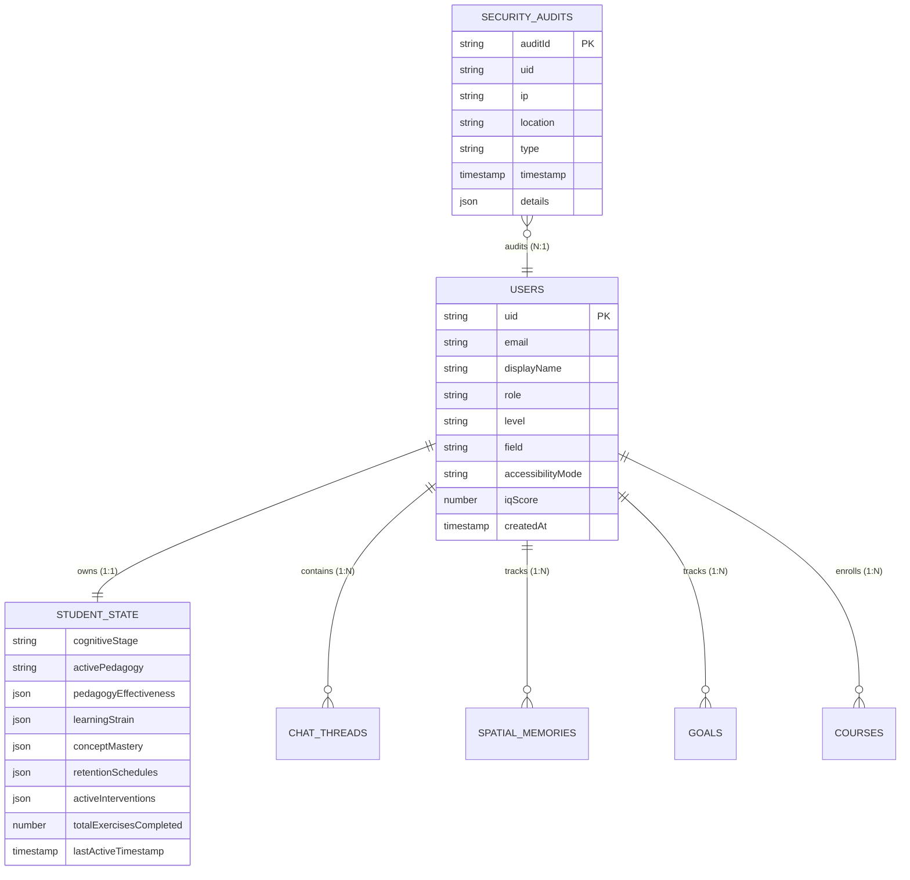

# Database Architecture & Persistence Strategy

> **Status**: [VERIFIED]  
> **Source Baseline**: `src/lib/firebase.ts`, `src/lib/studentStateEngine.ts`, `src/lib/databaseHub.ts`, `firestore.rules`  
> **Audience**: Database Administrators, Backend Engineers, and Security Architects  

---

## 1. Cloud Firestore Topology [VERIFIED]

Cognify utilizes Google Cloud Firestore provisioned in the **Frankfurt, Germany (`europe-west1`)** datacenter (`src/lib/databaseHub.ts:31`). This region ensures compliance with European GDPR privacy standards and offers minimal latency across Europe and the Middle East.



---

## 2. Document Hierarchy & Subcollections [VERIFIED]

Firestore uses nested subcollections under each user document to enforce **Strict Multi-Tenant Isolation**:

```
firestore-root/
├── users/
│   └── {uid}/                                    [User Profile Document]
│       ├── studentState/
│       │   └── current                           [Canonical Student State Document]
│       ├── chatThreads/
│       │   └── {threadId}                        [Individual Conversation Threads]
│       ├── spatialMemories/
│       │   └── {memoryId}                        [Physical Object Locations]
│       ├── courses/
│       │   └── {courseId}                        [Academic Transcript & Grades]
│       └── goals/
│           └── {goalId}                          [Personal Academic Goals]
└── securityAudits/
    └── {auditId}                                 [Global Security Telemetry Collection]
```

---

## 3. Quota Optimization: 5000ms Debounced Dot-Path Writes [VERIFIED]

To operate sustainably within the **Firebase Spark Free Tier** (50,000 reads/day, 20,000 writes/day), Cognify eliminates naive write-on-click patterns.

### The Debounced Update Mechanism:
In [`src/lib/studentStateEngine.ts`](file:///C:/Users/Tie/.gemini/antigravity/scratch/AI-Powered-Adaptive-Personal-Assistant/AI-Powered-Adaptive-Personal-Assistant-main/src/lib/studentStateEngine.ts), when an exercise is answered or a concept is tested:

1. **Local Cache Save (0ms)**: The state is immediately committed to synchronous in-memory state and persisted to `LocalStorage` (encrypted via Web Crypto AES-GCM 256-bit). The UI renders immediately without waiting for a cloud roundtrip.
2. **Concept Dirty Tracking**: The concept ID is appended to `pendingConcepts: Set<string>`.
3. **Debounce Timer**: A 5000ms timer is reset.
4. **Targeted Dot-Path Flush**: When the timer fires, instead of rewriting the entire monolithic document, `updateDoc` issues granular dot-path updates:
   ```ts
   // src/lib/studentStateEngine.ts:634
   const updates: Record<string, any> = {
     activePedagogy: this.state.activePedagogy,
     learningStrain: this.state.learningStrain,
     totalExercisesCompleted: this.state.totalExercisesCompleted,
     lastActiveTimestamp: this.state.lastActiveTimestamp,
   };

   for (const conceptId of this.pendingConcepts) {
     if (this.state.conceptMastery[conceptId]) {
       updates[`conceptMastery.${conceptId}`] = this.state.conceptMastery[conceptId];
     }
     if (this.state.retentionSchedules[conceptId]) {
       updates[`retentionSchedules.${conceptId}`] = this.state.retentionSchedules[conceptId];
     }
   }
   await updateDoc(studentStateDoc(this.state.uid), cleanDataForFirestore(updates));
   ```
5. **Page Unload Safety**: A `beforeunload` window event listener guarantees that any pending dirty state is flushed synchronously before the browser tab terminates.

---

## 4. Guest Session Virtualization [VERIFIED]

Guest users (`uid.startsWith('guest_')`) do not create Firestore documents. The `isGuestUser(uid)` utility short-circuits remote network calls, running 100% in-memory and in encrypted local storage. This guarantees zero quota consumption from unauthenticated visitors or external evaluation bots.
