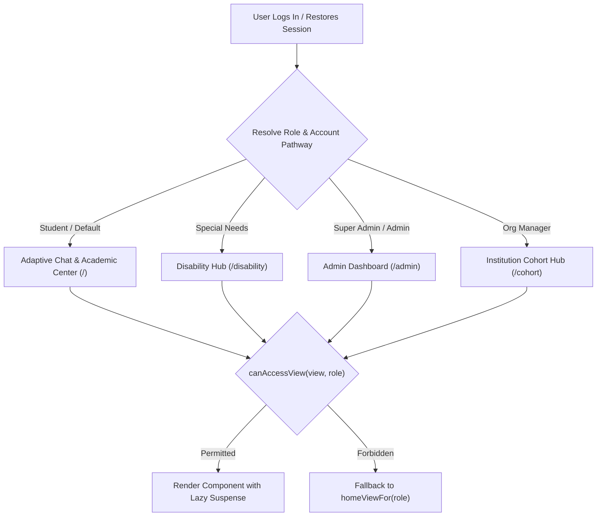

# Frontend Architecture

> **Status**: [VERIFIED]  
> **Source Baseline**: `src/App.tsx`, `vite.config.ts`, `package.json`, `src/components/`  
> **Audience**: Frontend Engineers and UI/UX Developers  

---

## 1. Technology Choices & Rationale [VERIFIED]

| Dependency | Version | Architectural Rationale |
| :--- | :--- | :--- |
| **React** | `19.0.0` | Concurrent rendering, fast reconciliation for real-time camera/canvas overlays, and optimized state transitions. |
| **TypeScript** | `~5.8.2` | 100% strict-mode typing. Eliminates runtime null pointer errors and enforces rigid contracts for student state and events. |
| **Vite** | `^6.2.0` | Sub-millisecond HMR during development, Rollup-based tree-shaking, and manual vendor chunking in production. |
| **Tailwind CSS** | `^4.1.14` | Modern CSS engine with the **Obsidian Dark Glassmorphism** design tokens (`#0A0C14`, `#121524`, backdrop blur). |
| **Framer Motion** | `^12.23.24`| GPU-accelerated micro-interactions, modal transitions, and smooth card elevation without blocking the main thread. |
| **Recharts** | `^3.8.1` | Declarative SVG charting for Bloom cognitive taxonomy, GPA trajectories, and concept mastery distributions. |
| **Lucide React** | `^0.546.0` | Tree-shakable, consistent vector iconography. |

---

## 2. Dynamic View Routing & Access Control [VERIFIED]

Routing is managed via declarative application view state in [`src/App.tsx`](file:///C:/Users/Tie/.gemini/antigravity/scratch/AI-Powered-Adaptive-Personal-Assistant/AI-Powered-Adaptive-Personal-Assistant-main/src/App.tsx) and guarded by [`src/lib/access.ts`](file:///C:/Users/Tie/.gemini/antigravity/scratch/AI-Powered-Adaptive-Personal-Assistant/AI-Powered-Adaptive-Personal-Assistant-main/src/lib/access.ts):



### Supported View Routes:
- `'chat'`: Adaptive chat, code explanation, micro-checks, and retention warmups.
- `'disability'`: Hub container (`'hub'`) switching between `'vision'`, `'motor'`, and `'sign'`.
- `'planner'`: Academic planner and exam countdown schedule.
- `'gpa'`: GPA calculator and What-If simulation sandbox.
- `'goals'`: Goal tracker and task milestones.
- `'gym'`: Cognitive gym exercises and IQ assessment.
- `'french'`: French travel voice assistant.
- `'profile'`: User profile, preferences, and GDPR account controls.
- `'memory'`: Transparent student memory management.
- `'cohort'`: Institution analytics for educators.
- `'admin'`: Super admin, Frankfurt latency, and security audits.

---

## 3. Bundle Splitting & Production Chunking [VERIFIED]

To ensure ultra-fast Time-to-Interactive (TTI) on mobile devices and assistive hardware, [`vite.config.ts`](file:///C:/Users/Tie/.gemini/antigravity/scratch/AI-Powered-Adaptive-Personal-Assistant/AI-Powered-Adaptive-Personal-Assistant-main/vite.config.ts) defines explicit manual vendor splitting:

```ts
// vite.config.ts manualChunks configuration
manualChunks: {
  'vendor-react': ['react', 'react-dom'],
  'vendor-firebase': ['firebase/app', 'firebase/auth', 'firebase/firestore', 'firebase/storage'],
  'vendor-motion': ['motion'],
  'vendor-icons': ['lucide-react'],
}
```

### Production Build Metrics (Vite 6 + esbuild):
- **Total Build Time**: ~29.36 seconds for 4,716 transformed modules.
- **Top Distributed Chunks**:
  - `vendor-firebase`: 669.56 kB (200.13 kB gzip)
  - `signClassifier`: 879.59 kB (229.22 kB gzip - loaded lazily only when entering Sign Studio)
  - `SignAvatar3D`: 520.58 kB (134.25 kB gzip - Three.js avatar loaded lazily)
  - `MotorEuphoniaView`: 187.89 kB (51.73 kB gzip)
  - `ChatInterface`: 268.39 kB (78.74 kB gzip)
  - `vendor-motion`: 128.37 kB (42.24 kB gzip)
  - Initial `index.html`: **2.28 kB** (0.94 kB gzip)

---

## 4. Render Optimization & Hardware Throttling [VERIFIED]

In intensive assistive views such as `MotorEuphoniaView.tsx`, tracker callbacks operate at display refresh rates (up to 120Hz). Uncontrolled re-renders cause severe garbage collection pressure and input lag. Cognify implements **Frame-Capped React Rendering**:

```ts
// src/components/MotorEuphoniaView.tsx:596
const lastPointerRenderRef = useRef(0);
const POINTER_RENDER_INTERVAL_MS = 33; // ~30fps render cap

// onPointerMove callback:
checkHoverTargetRef.current(pos); // Runs every single raw frame for 0ms latching
const now = Date.now();
if (now - lastPointerRenderRef.current < POINTER_RENDER_INTERVAL_MS) return;
lastPointerRenderRef.current = now;
setCursorPos(pos);        // React state updated at max 30Hz
setDwellProgress(prog);
```

This optimization reduces React virtual DOM reconciliation overhead by **50% to 75%** on low-end hardware without degrading dwell responsiveness.
