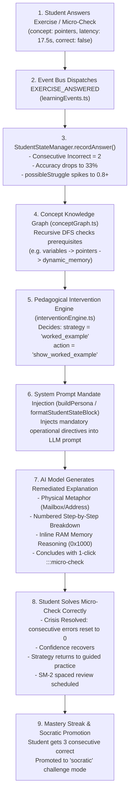

# The Closed-Loop Adaptive Learning Flow

> **Status**: [VERIFIED]  
> **Source Baseline**: `src/lib/studentStateEngine.ts`, `src/lib/conceptGraph.ts`, `src/lib/interventionEngine.ts`, `api/_lib/ai.ts`, `tests/goldenAdaptiveScenario.ts`  
> **Audience**: AI Engineers, Pedagogical Researchers, and Core Developers  

---

## 1. End-to-End Closed-Loop Lifecycle

The closed-loop adaptive cycle in Cognify is not a theoretical model; it is an active, deterministic pipeline verified by **62 automated assertions** in `tests/goldenAdaptiveScenario.ts`:



---

## 2. Mathematical Formulations [VERIFIED]

### A. Empirical Learning Strain ($S$)
Cognify does not guess whether a student is struggling; it computes an empirical strain scalar $S \in [0.0, 1.0]$ based on response latency and consecutive mistakes:

$$\text{latencyWeight} = \min\left(0.5, \frac{\text{responseTimeMs}}{30000}\right)$$

$$\text{errorWeight} = \min(0.5, \text{consecutiveIncorrect} \times 0.25)$$

$$S = \min(1.0, \text{round}((\text{latencyWeight} + \text{errorWeight}) \times 100) / 100)$$

- If $S \ge 0.7$, the deterministic router re-classifies even short concept questions as `reasoning` tasks, directing them to deep-reasoning models (GLM-5.2 / DeepSeek-R1).

### B. SuperMemo SM-2 Spaced Retention
When a student completes an exercise on concept $C$, the system updates its retention schedule:

$$EF' = EF + (0.1 - (5 - q) \times (0.08 + (5 - q) \times 0.02))$$

Where:
- $EF$ is the Ease Factor (initialized at $2.5$, bounded below by $1.3$).
- $q \in [0, 5]$ is the retrieval quality score ($q = 5$ for quick correct answers $<8\text{s}$, $q = 4$ for slower correct answers, $q = 2$ for incorrect answers).

**Interval Progression ($I$ in days)**:
- Attempt 1 ($n=1$): $I = 1\text{ day}$.
- Attempt 2 ($n=2$): $I = 6\text{ days}$ (if $q \ge 3$).
- Subsequent ($n > 2$): $I_n = \text{round}(I_{n-1} \times EF')$.
- If $q < 3$: Interval resets to $I = 1\text{ day}$ and repetition count resets to $0$.

### C. Hake's Normalized Learning Gain ($g$)
Evaluates pre-test vs. post-test conceptual acquisition:

$$g = \frac{\text{PostScore} - \text{PreScore}}{100 - \text{PreScore}}$$

- **High Gain**: $g \ge 0.7$
- **Medium Gain**: $0.3 \le g < 0.7$
- **Low Gain**: $g < 0.3$

---

## 3. Mandatory Prompt Directives [VERIFIED]

When an intervention fires, [`formatStudentStateBlock`](file:///C:/Users/Tie/.gemini/antigravity/scratch/AI-Powered-Adaptive-Personal-Assistant/AI-Powered-Adaptive-Personal-Assistant-main/api/_lib/ai.ts:270) injects the following unmissable directives into the AI system instructions:

```markdown
## MANDATORY PEDAGOGICAL INTERVENTION (HIGHEST OVERRIDE PRIORITY)
### ACTIVE INTERVENTION DIRECTIVE:
- Target Concept: pointers
- Strategy: worked_example
- Recommended Action: show_worked_example

### OPERATIONAL DIRECTIVES FOR WORKED EXAMPLES:
1. CONCRETE ANALOGY FIRST: Ground the concept with an everyday physical metaphor (mailboxes, house addresses vs contents, storage lockers) BEFORE showing code syntax.
2. NUMBERED STEP-BY-STEP EXAMPLE: Present a minimal, complete worked example broken down sequentially (Step 1, Step 2, Step 3).
3. INLINE MEMORY REASONING: Explicitly narrate what happens in computer memory (RAM layout, stack addresses like 0x1000, value vs address).
4. FORMATIVE MICRO-CHECK: Conclude with a single 1-click understanding check block (:::micro-check).

### STRICT PROHIBITIONS:
- DO NOT provide abstract, dry theoretical definitions without the physical analogy.
- DO NOT leave the student without a concrete micro-check to verify understanding.
```

---

## 4. Remediation Recovery & Socratic Promotion [VERIFIED]

1. **Recovery**: When the student successfully solves the micro-check, `recordAnswer` registers a correct attempt. Consecutive errors reset to 0, confidence increases by $+0.12$, and `activePedagogy` gracefully transitions from emergency `worked_example` back to guided `scaffolded`.
2. **Pedagogy Efficacy**: If the student rates the explanation with a thumbs-up, `recordPedagogyFeedback` raises that strategy's dynamic effectiveness score ($+0.05$).
3. **Mastery Streak Promotion**: When a student achieves **3 consecutive correct answers** on a topic (`consecutiveCorrect >= 3`), the intervention engine automatically promotes the pedagogy to `socratic`:
   - Enforces inductive questioning rather than direct answers.
   - Probes edge cases, algorithmic complexity ($O(N)$), and production architectural trade-offs.
