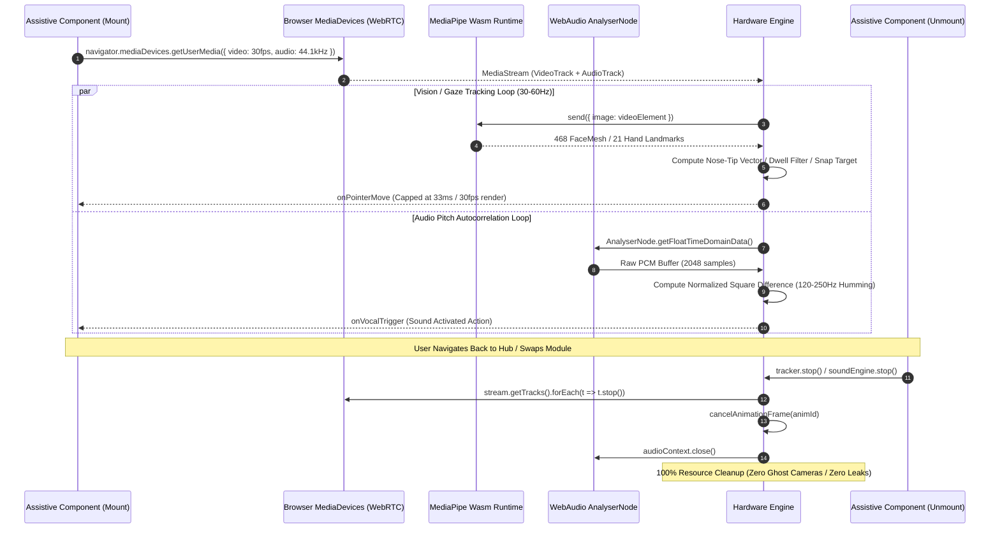

# Assistive Hardware & Edge AI Perception Flow

> **Status**: [VERIFIED]  
> **Source Baseline**: `src/lib/facialHeadTracker.ts`, `src/lib/vocalSoundTrigger.ts`, `src/components/VisionCompanionView.tsx`, `src/components/MotorEuphoniaView.tsx`, `src/components/SignVideoStudio.tsx`  
> **Audience**: Computer Vision Engineers, Accessibility Engineers, and Embedded ML Developers  

---

## 1. Hardware Pipeline Architecture



---

## 2. Head-Tracking & Eye-Gaze Mechanics (`facialHeadTracker.ts`) [VERIFIED]

The `FacialHeadTracker` provides hands-free mouse emulation calibrated for users with ALS, muscular dystrophy, or quadriplegia:

### A. Coordinate Mapping & Tremor Suppression
1. **Nose-Tip Vector Tracking**: Index `1` in MediaPipe FaceMesh represents the tip of the nose. Its relative $X/Y$ coordinates inside the face bounding box drive the normalized cursor:
   $$X_{\text{norm}} = \frac{x_{\text{nose}} - x_{\text{boxMin}}}{x_{\text{boxMax}} - x_{\text{boxMin}}}$$
2. **Anti-Tremor Deadband Filter**: Minor involuntary tremors below a calibrated threshold ($< 0.004$ normalized units) are filtered out, preventing jitter on small buttons.
3. **Magnetic Snapping (Snap-to-Target)**: If the cursor enters the attraction radius of an active button or keyboard key, it gently locks to the element center to make clicking effortless.
4. **Dwell Click Timer**: When the pointer remains within a target card's bounding box for **800ms to 1200ms**, the target triggers automatically without requiring a physical tap.

### B. Eye Blink & Smile Gestures
- **Eye Aspect Ratio (EAR)**: Computed from upper/lower eyelid landmarks. A drop below the calibrated threshold for $150\text{ms}$ to $400\text{ms}$ registers a deliberate blink-click while ignoring involuntary micro-blinks ($<100\text{ms}$).
- **Lip Corner Delta**: Measures the distance between landmarks 61 and 291 (lip corners). An upward elevation above the baseline registers a smile gesture, which can double as a switch input.

---

## 3. Vocal Sound Triggers & FFT Pitch Autocorrelation (`vocalSoundTrigger.ts`) [VERIFIED]

For users who cannot move their head or blink reliably, Cognify provides sound-activated switching based on **vocal humming**:

```ts
// src/lib/vocalSoundTrigger.ts:182
// Real-time pitch extraction via time-domain autocorrelation:
const audioContext = new (window.AudioContext || (window as any).webkitAudioContext)();
const analyser = audioContext.createAnalyser();
analyser.fftSize = 2048;
```

1. **Autocorrelation Algorithm**: Evaluates raw audio frames using normalized square difference to detect the fundamental frequency ($F_0$).
2. **Target Band (120 Hz – 250 Hz)**: Calibrated to detect steady vowel humming tones (e.g. *"Mmmmm"* or *"Aaaaa"*).
3. **Noise Immunity**: Ambient background chatter, coughs, and sharp clicks are rejected because they lack a sustained fundamental periodic waveform over the $300\text{ms}$ duration window.

---

## 4. Hardware Lifecycle Isolation Rule [VERIFIED]

> **The Hardware Isolation Invariant**:  
> No camera video track, microphone audio track, or `requestAnimationFrame` loop may remain active when navigating between Disability Hub modules or exiting to other platform views.

Every assistive component implements strict cleanup in its `useEffect` teardown:

```ts
// Verified teardown pattern across all assistive components:
useEffect(() => {
  return () => {
    if (streamRef.current) {
      streamRef.current.getTracks().forEach((track) => track.stop());
      streamRef.current = null;
    }
    if (animFrameIdRef.current) {
      cancelAnimationFrame(animFrameIdRef.current);
    }
    if (audioContextRef.current && audioContextRef.current.state !== 'closed') {
      audioContextRef.current.close();
    }
  };
}, []);
```

This guarantees zero camera conflict when switching between the Vision Companion and Motor Euphonia, and eliminates battery drain and memory leaks.
