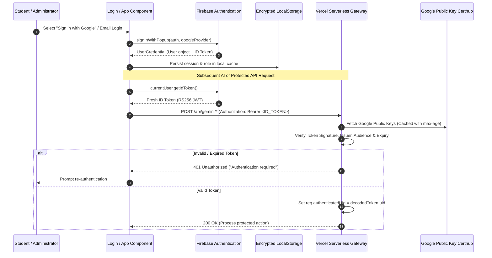

# Authentication & Access Control Flow

> **Status**: [VERIFIED]  
> **Source Baseline**: `src/lib/access.ts`, `src/lib/roles.ts`, `api/_lib/authGuard.ts`, `src/components/Login.tsx`  
> **Audience**: Security Engineers, Backend Developers, and Frontend Developers  

---

## 1. Authentication Lifecycle Flow



---

## 2. Guest User Mode Virtualization [VERIFIED]

Cognify supports an instantaneous **Guest Pathway** allowing users, prospective students, and thesis evaluation committees to explore the system without signing up:

```ts
// src/lib/learningEvents.ts:18
export const isGuestUser = (uid?: string): boolean => {
  if (!uid) return true;
  return uid.startsWith('guest_') || uid === 'guest' || uid === 'anonymous';
};
```

### Invariants for Guest Sessions:
1. **Zero Remote Firestore Writes**: All state transitions (`recordAnswer`, `pedagogyFeedback`) write strictly to client memory and LocalStorage.
2. **Deterministic Fallbacks**: AI endpoints detect guest sessions and apply specialized public rate limits.
3. **Session Preservation**: If a guest subsequently decides to create an account, their in-memory student state and learning history can be exported via JSON or linked to the newly created Firebase UID.

---

## 3. Role-Based Access Control (RBAC) [VERIFIED]

Located in [`src/lib/roles.ts`](file:///C:/Users/Tie/.gemini/antigravity/scratch/AI-Powered-Adaptive-Personal-Assistant/AI-Powered-Adaptive-Personal-Assistant-main/src/lib/roles.ts) and [`src/lib/access.ts`](file:///C:/Users/Tie/.gemini/antigravity/scratch/AI-Powered-Adaptive-Personal-Assistant/AI-Powered-Adaptive-Personal-Assistant-main/src/lib/access.ts):

### Role Hierarchy & Permissions Matrix:

| Role | Default Home View | Accessible Views | Special Permissions |
| :--- | :--- | :--- | :--- |
| **Student** | `'chat'` | `chat`, `planner`, `gpa`, `goals`, `gym`, `french`, `profile`, `memory` | Standard learning & adaptive cycle. |
| **Special Needs** | `'disability'` | `disability`, `chat`, `profile`, `memory`, `french` | Direct launch into Vision/Motor/Sign Hub. |
| **Graduation Project** | `'chat'` | All student views + `disability` | Evaluation sandbox with access to all modules. |
| **Org Manager** | `'cohort'` | `cohort`, `profile` | View aggregated analytics across student cohorts (Zero raw chat text access). |
| **Admin** | `'admin'` | `admin`, `cohort`, `profile`, `chat` | System management and quota monitoring. |
| **Super Admin** | `'admin'` | ALL views without exception | Full database backups, security audit logs, user role assignments. |

---

## 4. Founders Lockout Protection [VERIFIED]

To protect against administrative lockouts or malicious role revocation in production:
```ts
// src/lib/roles.ts:12
export const IMMUTABLE_SUPER_ADMIN_EMAILS = [
  'mahmoud.hashim.pro@gmail.com',
  // Founders / Thesis Committee Leaders
];
```
Even if a compromised administrative account attempts to modify roles in the Firestore database, client and server verification layers enforce super admin privileges for immutable founder emails regardless of database state.
