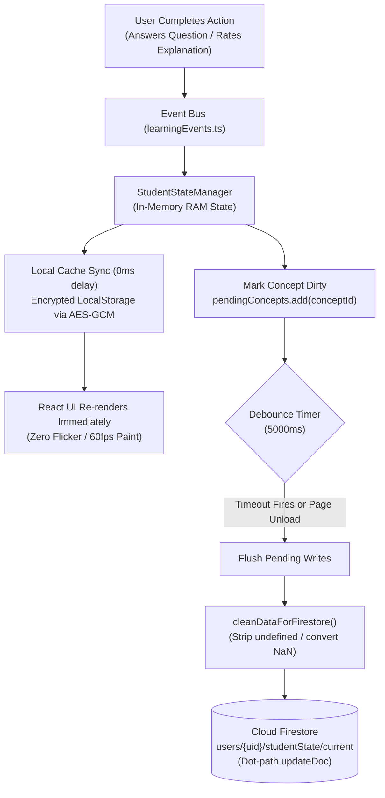
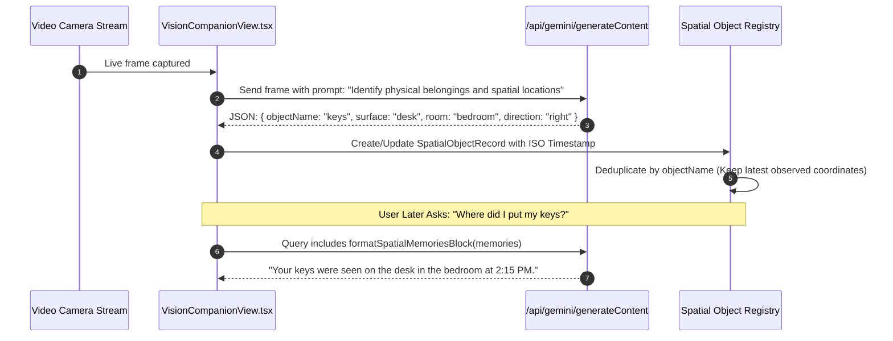

# Data Flow & Persistence Lifecycle

> **Status**: [VERIFIED]  
> **Source Baseline**: `src/lib/studentStateEngine.ts`, `src/lib/cryptoShield.ts`, `src/components/StudentPrivacyCenter.tsx`  
> **Audience**: Full-Stack Developers, Database Engineers, and Privacy Officers  

---

## 1. End-to-End State Propagation Flow

---

## 2. Conversational Message Pipeline [VERIFIED]

1. **Optimistic Dispatch**: When a student enters a query in [`ChatInterface.tsx`](file:///C:/Users/Tie/.gemini/antigravity/scratch/AI-Powered-Adaptive-Personal-Assistant/AI-Powered-Adaptive-Personal-Assistant-main/src/components/ChatInterface.tsx), an optimistic user message is immediately injected into the local chat thread array with a temporary ID.
2. **Context Compilation**:
   - Compiles the last 12 historical messages (`safeHistory.slice(-12)`).
   - Encodes any image/PDF attachments as clean base64 data.
   - Summarizes past chat threads (`threadsSummary`).
   - Generates the current pedagogical system instructions via `buildPersona()`.
3. **SSE Streaming Ingestion**: The client connects to `/api/gemini/generateAdaptiveResponseStream` via fetch and consumes the stream using `TextDecoder`:
   - Incoming SSE frames (`data: {"text": "...", "done": false}`) update the assistant's placeholder message progressively.
   - Custom `:::micro-check` blocks are detected and rendered as interactive buttons.
4. **Thread Persistence**: When the stream completes (`done: true`), the finalized conversation turn is written to the user's active thread in `users/{uid}/chatThreads/{threadId}`.

---

## 3. Spatial Memory Pipeline [VERIFIED]

Used by the Vision Companion to help blind students locate physical objects in their living space:

---

## 4. GDPR & FERPA Right to Forget & Data Export [VERIFIED]

In [`src/components/StudentPrivacyCenter.tsx`](file:///C:/Users/Tie/.gemini/antigravity/scratch/AI-Powered-Adaptive-Personal-Assistant/AI-Powered-Adaptive-Personal-Assistant-main/src/components/StudentPrivacyCenter.tsx):

### A. Full Data Export (`exportUserDataAsJson`)
Compiles a complete, portable JSON archive including:
- User profile and authentication metadata.
- Complete event-sourced student state and concept mastery history.
- Spaced retention intervals and Hake normalized gain scores.
- All historical chat threads and summaries.
- Spatial object tracking memory.

### B. Cascade Account Deletion (`deleteUserDataCascade`)
When a student requests account termination:
1. Deletes all documents in subcollections (`studentState`, `chatThreads`, `spatialMemories`, `courses`, `goals`).
2. Deletes the root user document in `users/{uid}`.
3. Clears all browser `LocalStorage` and `SessionStorage` encryption keys.
4. Terminates the Firebase Auth account permanently.
