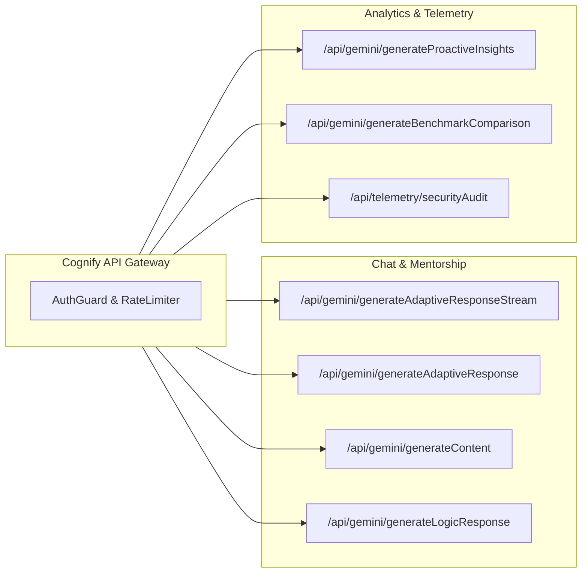

# API Architecture Overview

> **Status**: [VERIFIED]  
> **Source Baseline**: `api/_lib/`, `api/gemini/`, `api/telemetry/`  
> **Audience**: API Consumers, Backend Engineers, and Security Auditors  

---

## 1. Gateway Design & Security Standards [VERIFIED]

The Cognify 2.0 API tier is engineered as an authenticated, rate-limited, and sanitized serverless gateway. The API enforces the following universal operational standards:

### A. Communication Protocol
- **Transport**: HTTPS with TLS 1.3.
- **Payload Format**: Strict JSON (`application/json; charset=utf-8`) for standard endpoints, and Server-Sent Events (`text/event-stream; charset=utf-8`) for streaming inference.
- **HTTP Methods**: Exclusively `POST` for execution endpoints. Non-POST requests are rejected with `405 Method Not Allowed`.

### B. Authentication Handshake
Every API request must present a cryptographically signed Firebase ID token in the HTTP Authorization header:
```http
Authorization: Bearer <FIREBASE_ID_TOKEN>
```
The token is decoded and validated via RS256 public key verification in [`api/_lib/authGuard.ts`](file:///C:/Users/Tie/.gemini/antigravity/scratch/AI-Powered-Adaptive-Personal-Assistant/AI-Powered-Adaptive-Personal-Assistant-main/api/_lib/authGuard.ts).

### C. Rate Limiting Headers
The gateway attaches diagnostic rate limiting headers to every HTTP response:
```http
X-RateLimit-Limit-IP: 100
X-RateLimit-Remaining-IP: 89
X-RateLimit-Limit-User: 60
X-RateLimit-Remaining-User: 54
```
If either threshold is breached, the API responds with `429 Too Many Requests` accompanied by a standard `Retry-After: <seconds>` header.

---

## 2. API Topology & Endpoint Catalog



| Endpoint | Method | Response Type | Primary Purpose |
| :--- | :--- | :--- | :--- |
| `/api/gemini/generateAdaptiveResponseStream` | `POST` | `text/event-stream` | Streaming conversational response with real-time CoT stripping and micro-checks. |
| `/api/gemini/generateAdaptiveResponse` | `POST` | `application/json` | Non-streaming adaptive response passed through `qualityGuard.ts`. |
| `/api/gemini/generateContent` | `POST` | `application/json` | Universal multimodal text & image/PDF generation. |
| `/api/gemini/generateLogicResponse` | `POST` | `application/json` | Deep logical reasoning and structured pedagogical analysis. |
| `/api/gemini/generateProactiveInsights` | `POST` | `application/json` | Automated pedagogical recommendations based on learning strain and retention decay. |
| `/api/gemini/generateBenchmarkComparison` | `POST` | `application/json` | Evaluates student cohort performance against standard academic benchmarks. |
| `/api/telemetry/securityAudit` | `POST` | `application/json` | Logs intrusion telemetry (DevTools opening, tampering, client IP). |
