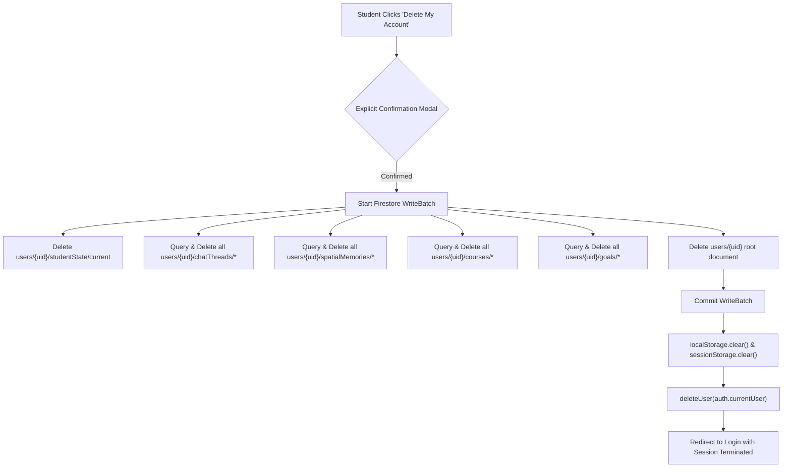

# Database Relationships & Multi-Tenant Isolation

> **Status**: [VERIFIED]  
> **Source Baseline**: `firestore.rules`, `src/lib/firebase.ts`, `src/components/StudentPrivacyCenter.tsx`  
> **Audience**: Cloud Architects, Database Administrators, and Compliance Officers  

---

## 1. Data Ownership & Relationship Topology

```mermaid
classDiagram
    class UserProfile {
        +string uid PK
        +string email
        +string role
    }

    class StudentState {
        +string activePedagogy
        +json conceptMastery
        +json retentionSchedules
    }

    class ChatThread {
        +string id PK
        +string title
        +Array messages
    }

    class SpatialMemory {
        +string id PK
        +string objectName
        +string surface
    }

    class SecurityAudit {
        +string auditId PK
        +string uid FK
        +string ip
        +string type
    }

    UserProfile "1" *-- "1" StudentState : owns directly (1:1)
    UserProfile "1" *-- "0..*" ChatThread : owns subcollection (1:N)
    UserProfile "1" *-- "0..*" SpatialMemory : owns subcollection (1:N)
    UserProfile "1" <.. "0..*" SecurityAudit : audited by (N:1)
```

---

## 2. Multi-Tenant Isolation Boundaries [VERIFIED]

Cognify enforces strict multi-tenant boundaries at the database layer via **Firestore Security Rules**:

### A. Private Data Boundary (Student Conversations)
- **Rule**: `request.auth.uid == resource.data.uid`
- **Implication**: Even if an academic institution, university professor, or department chair uses the **Institution Cohort Hub**, they **CANNOT** read raw conversational chat messages or personal spatial object locations of any student. They are presented solely with anonymized, aggregated KPI trends (e.g. average Bloom level, course completion rates).

### B. Security Audit Boundary
- **Create Rule**: Authenticated students and guest sessions are permitted to write intrusion audit entries (`allow create: if true;`).
- **Read / Delete Rule**: Strictly restricted to Super Admins (`allow read, delete: if isSuperAdmin();`). Regular students and standard administrators cannot view, tamper with, or delete audit traces.

---

## 3. Data Cleansing & Sanitization (`cleanDataForFirestore`) [VERIFIED]

Firestore throws runtime exceptions if an object payload contains `undefined` values. Cognify implements a recursive pre-write sanitizer [`src/lib/firebase.ts:46`](file:///C:/Users/Tie/.gemini/antigravity/scratch/AI-Powered-Adaptive-Personal-Assistant/AI-Powered-Adaptive-Personal-Assistant-main/src/lib/firebase.ts):

```typescript
export function cleanDataForFirestore(obj: any): any {
  if (obj === null || obj === undefined) return null;
  if (typeof obj !== 'object') return obj;
  if (Array.isArray(obj)) return obj.map(cleanDataForFirestore);
  
  const clean: Record<string, any> = {};
  for (const [key, value] of Object.entries(obj)) {
    if (value === undefined) {
      clean[key] = null; // Convert undefined to null for safe Firestore ingestion
    } else if (typeof value === 'object') {
      clean[key] = cleanDataForFirestore(value);
    } else {
      clean[key] = value;
    }
  }
  return clean;
}
```

---

## 4. Cascade Account Deletion Flow [VERIFIED]

To guarantee full GDPR and FERPA compliance when a user requests the **Right to be Forgotten**, [`src/components/StudentPrivacyCenter.tsx`](file:///C:/Users/Tie/.gemini/antigravity/scratch/AI-Powered-Adaptive-Personal-Assistant/AI-Powered-Adaptive-Personal-Assistant-main/src/components/StudentPrivacyCenter.tsx) executes a deterministic batch deletion sequence:


