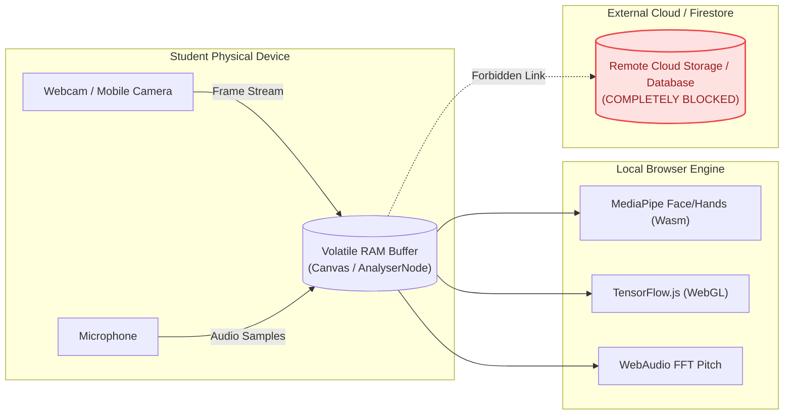

# Privacy Specification & Zero-Knowledge Architecture

> **Status**: [VERIFIED]  
> **Source Baseline**: `src/components/StudentPrivacyCenter.tsx`, `src/components/VisionCompanionView.tsx`, `src/lib/vocalSoundTrigger.ts`  
> **Audience**: Privacy Officers, Legal Compliance, and End Users  

---

## 1. Zero-Knowledge Media Processing Invariant [VERIFIED]

A core ethical requirement of Cognify 2.0 is the complete protection of vulnerable students using assistive technologies (blind students using camera feeds, speech-impaired students using microphones):

> **The Zero-Knowledge Media Rule**:  
> **No video feed, camera frame, audio sample, or microphone recording is EVER transmitted to any remote cloud database or persisted to disk.**

### Technical Implementation:
1. **Camera Frame Discard**: In `VisionCompanionView.tsx`, when a frame is analyzed, it is captured into an offscreen canvas in volatile RAM, encoded to an ephemeral base64 string for immediate LLM inference, and the canvas buffer is immediately cleared.
2. **Audio Track Discard**: In `vocalSoundTrigger.ts`, the microphone input is processed purely through a 2048-sample circular PCM buffer in memory. No audio chunks are written to IndexedDB or uploaded to any telemetry endpoint.
3. **Sign Recognition**: In `SignVideoStudio.tsx`, the 21 joint landmark coordinates are inferred via local WebGL shaders. Not a single pixel leaves the student's browser.

---

## 2. Epistemic Privacy & Educational Confidentiality [VERIFIED]

1. **Student Conversations are Sovereign**: High school and university students discussing personal struggles, academic doubts, or emotional distress have complete assurance that their messages cannot be read by institution mentors.
2. **Aggregated Insights Only**: Educators can see that "60% of students in CS101 struggle with Pointers", but they can never view the conversation transcript of any individual student.
3. **Transparent Memory Control**: Through the **Student Memory Page** (`StudentMemoryPage.tsx`), students can view every single concept, fact, or preference remembered by the AI mentor, toggle memory off completely, or delete individual memory records with one click.

---

## 3. Regulatory Compliance Checklist

| Standard | Requirement | Cognify 2.0 Architectural Realization |
| :--- | :--- | :--- |
| **GDPR Art. 17** | Right to Erasure ("Right to be Forgotten") | 1-Click cascade account deletion purging Firestore subcollections and local storage. |
| **GDPR Art. 20** | Right to Data Portability | 1-Click full JSON export archive containing user profile, mastery history, and threads. |
| **FERPA** | Protection of Student Education Records | Multi-tenant isolation, role-based access control, and zero commercial tracking cookies. |
| **COPPA** | Children's Online Privacy | Zero third-party ad networks, zero biometric database storage, zero sale of student telemetry. |
