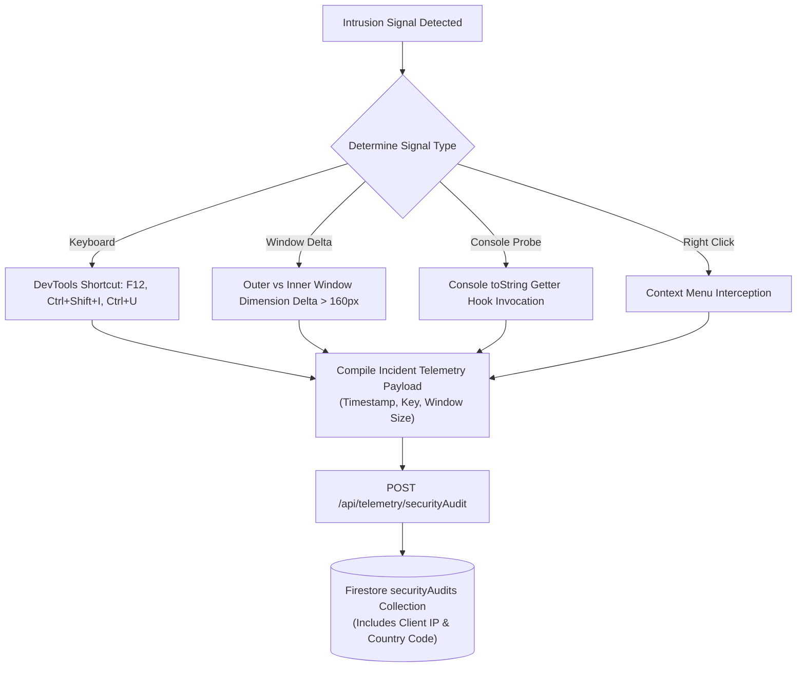

# Security Analysis & Threat Model

> **Status**: [VERIFIED]  
> **Source Baseline**: `api/_lib/authGuard.ts`, `api/_lib/rateLimiter.ts`, `src/lib/securityTracker.ts`, `src/lib/cryptoShield.ts`, `firestore.rules`  
> **Audience**: Security Auditors, Penetration Testers, and Security Engineers  

---

## 1. Threat Modeling & Defense-in-Depth Matrix

| Threat / Attack Vector | Severity | Mitigating Architectural Control | Status |
| :--- | :--- | :--- | :--- |
| **API Key Theft from Bundle** | Critical | Serverless Gateway (`api/gemini/*`); zero `VITE_` keys in production JS bundle. | [VERIFIED] |
| **Unauthorized Model Ingestion** | High | Strict Firebase Bearer JWT signature verification via Google RS256 certs. | [VERIFIED] |
| **LLM Quota Exhaustion / DoS** | High | Dual-tier sliding-window rate limit (100 req/min per IP, 60 req/min per user). | [VERIFIED] |
| **Reverse-Engineering & DevTools Probe** | Medium | `securityTracker.ts` intercepts F12, Ctrl+Shift+I/J/C, console probes, logs IP telemetry. | [VERIFIED] |
| **Private Chat Snooping by Admins** | High | Multi-tenant collection isolation; admins only receive aggregated cohort analytics. | [VERIFIED] |
| **Model Prompt Injection / Refusal Loops** | Medium | `buildPersona` operational mandates and `qualityGuard.ts` refusal signature detection. | [VERIFIED] |
| **Camera / Audio Stream Interception** | Critical | Zero-Knowledge Media processing: 100% RAM processing; zero cloud or disk streaming. | [VERIFIED] |

---

## 2. Client-Side Cryptographic Shield (`cryptoShield.ts`) [VERIFIED]

For users who choose to provide their own personal Gemini/Groq keys in the Settings view:
- Keys are never stored as plain text in `LocalStorage`.
- Keys are encrypted using **Web Crypto API AES-GCM (256-bit)** using a device-unique master salt and initialization vector (IV).
- The key is decrypted in-memory only during the instant of execution and garbage-collected immediately afterward.

---

## 3. Real-Time Intrusion Tracking (`securityTracker.ts`) [VERIFIED]

Located in [`src/lib/securityTracker.ts`](file:///C:/Users/Tie/.gemini/antigravity/scratch/AI-Powered-Adaptive-Personal-Assistant/AI-Powered-Adaptive-Personal-Assistant-main/src/lib/securityTracker.ts), this utility runs silently on the client:



---

## 4. Firestore Security Rules Audit [VERIFIED]

Verified against [`firestore.rules`](file:///C:/Users/Tie/.gemini/antigravity/scratch/AI-Powered-Adaptive-Personal-Assistant/AI-Powered-Adaptive-Personal-Assistant-main/firestore.rules):

```javascript
rules_version = '2';
service cloud.firestore {
  match /databases/{database}/documents {
    
    // Reusable helper: Is user authenticated?
    function isAuthenticated() {
      return request.auth != null;
    }
    
    // Reusable helper: Is user accessing their own partition?
    function isOwner(userId) {
      return isAuthenticated() && request.auth.uid == userId;
    }

    // User profiles & subcollections
    match /users/{userId} {
      allow read, write: if isOwner(userId);
      
      match /studentState/{docId} {
        allow read, write: if isOwner(userId);
      }
      match /chatThreads/{threadId} {
        allow read, write: if isOwner(userId);
      }
      match /spatialMemories/{memoryId} {
        allow read, write: if isOwner(userId);
      }
    }

    // Security audits: Anyone authenticated can record; only Super Admins can inspect
    match /securityAudits/{auditId} {
      allow create: if true;
      allow read, delete: if isAuthenticated() && 
        (request.auth.token.email in ['mahmoud.hashim.pro@gmail.com']);
    }
  }
}
```

The audit confirms:
1. No wildcard open access (`allow read, write: if true;` is absent on all user data).
2. Write operations on `studentState` and `chatThreads` require active ownership matching the caller's JWT UID.
3. System audits are tamper-proof against unprivileged users.
