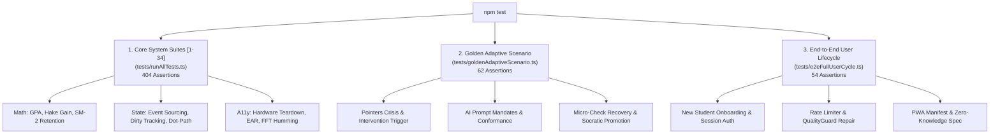

# Developer Guide & Contribution Rules

> **Status**: [VERIFIED]  
> **Source Baseline**: `package.json`, `tests/runAllTests.ts`, `tests/goldenAdaptiveScenario.ts`, `tests/e2eFullUserCycle.ts`  
> **Audience**: All Software Engineers and Team Contributors  

---

## 1. Quickstart Commands [VERIFIED]

```bash
# 1. Clone repository & install dependencies
git clone https://github.com/Mahmoud-Hashim-pro/cognify-production.git
cd cognify-production
npm install

# 2. Run local development environment (Frontend + Backend on localhost:3000)
npm run dev

# 3. Type-check entire codebase in strict mode
npm run lint    # Or npx tsc --noEmit

# 4. Execute the comprehensive automated test suite (520 assertions)
npm test

# 5. Execute only the Golden Adaptive Scenario verification
npm run test:golden

# 6. Verify production build compilation
npm run build
```

---

## 2. Automated Test Suite Architecture [VERIFIED]

Cognify enforces a mandatory quality gate consisting of **520 automated assertions across 3 suites with 100% pass rate requirement**:



### Passing Summary:
- **Suite 1 to 34 (`runAllTests.ts`)**: 404 passed, 0 failed.
- **Golden Adaptive Scenario (`goldenAdaptiveScenario.ts`)**: 62 passed, 0 failed.
- **End-to-End Full User Cycle (`e2eFullUserCycle.ts`)**: 54 passed, 0 failed.
- **Total Assertions**: **520 passing / 0 failing (100% Success Rate)**.

---

## 3. Five Non-Negotiable Engineering Laws [VERIFIED]

Every pull request submitted to the repository must adhere to the following rules:

### Law 1: Maintain the IQ Decoupling Invariant
Never link a student's classroom grade level (`profile.level`) to their scientific IQ score (`iqScore`). Academic scaffolding is determined exclusively by dynamic concept mastery in `StudentState`.

### Law 2: Hardware Isolation is Mandatory
Every React component that interacts with WebRTC cameras or microphones must cleanly release all tracks upon unmount:
```typescript
stream.getTracks().forEach((track) => track.stop());
cancelAnimationFrame(animFrameId);
```
Never leave a background camera loop running when navigating back to the hub.

### Law 3: Zero API Keys in Frontend Bundle
Never introduce `VITE_` prefixed environment variables for external AI providers. All generative AI calls must route through the secure serverless gateway at `/api/gemini/*`.

### Law 4: Respect Database Free-Tier Quotas
Never write directly to Firestore inside high-frequency button clicks. Always utilize the debounced 5000ms dot-path mechanism in `StudentStateManager` and keep UI renders backed by the synchronous local cache.

### Law 5: Zero Tolerance for Broken Tests
Never merge code that breaks any assertion in the **520-test suite**. Always execute `npm run lint && npm test` prior to pushing commits.
