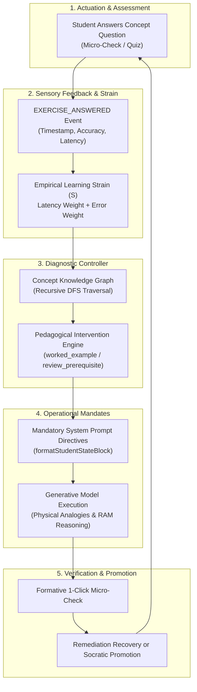

# Closed-Loop Adaptive Pedagogy: Mathematical Foundations & Architecture

> **Status**: [VERIFIED]  
> **Source Baseline**: `src/lib/studentStateEngine.ts`, `src/lib/conceptGraph.ts`, `src/lib/interventionEngine.ts`, `tests/goldenAdaptiveScenario.ts`  
> **Audience**: AI Researchers, Educational Technologists, and Cognitive Scientists  

---

## 1. The Closed-Loop Paradigm

Standard educational platforms operate as **open-loop systems**: content is delivered, the student attempts an assessment, and the system records a grade. If the student struggles, the instructional behavior of the platform does not systematically change.

Cognify 2.0 establishes a **Closed-Loop Cybernetic Pedagogical Loop**:



---

## 2. Mathematical Models [VERIFIED]

### A. Real-Time Learning Strain Score ($S$)
Cognify calculates student strain without relying on unreliable self-reporting:

$$S(t) = \min\left(1.0, \, \min\left(0.5, \frac{\Delta t}{30000}\right) + \min(0.5, E_{\text{cons}} \times 0.25)\right)$$

Where:
- $\Delta t$ is the response time in milliseconds. Latency above $15\text{s}$ elevates the latency penalty up to its ceiling of $0.5$.
- $E_{\text{cons}}$ is the consecutive incorrect answers count. Two consecutive errors trigger an error penalty of $0.5$.
- When $S \ge 0.7$, the student is empirically categorized as experiencing acute cognitive overload.

### B. Recursive Knowledge Graph Prerequisite Diagnosis
When a student struggles with concept $C_k$, the diagnosis function evaluates all directed ancestor nodes in the Concept Knowledge Graph:

$$\text{RootGap}(C_k) = \operatorname{DFS}(C_k) \quad \text{where} \quad \operatorname{Accuracy}(C_{\text{ancestor}}) < 0.60 \;\lor\; \operatorname{Confidence}(C_{\text{ancestor}}) < 0.50$$

If an unmastered prerequisite $C_{\text{prereq}}$ is detected (e.g. `pointers` when attempting `dynamic_memory`), the system suspends advanced instruction and automatically prescribes `review_prerequisite`.

### C. SuperMemo SM-2 Spaced Retention
To counter the **Ebbinghaus Forgetting Curve**, every concept $C_k$ is tracked under the SM-2 spaced repetition algorithm:

$$EF' = EF + (0.1 - (5 - q) \times (0.08 + (5 - q) \times 0.02))$$

$$I(n) = \begin{cases} 
1 & \text{if } n = 1 \\
6 & \text{if } n = 2 \text{ and } q \ge 3 \\
\operatorname{round}(I(n-1) \times EF') & \text{if } n > 2 \text{ and } q \ge 3 \\
1 & \text{if } q < 3 
\end{cases}$$

Where $q \in [0, 5]$ reflects answer accuracy and response latency.

### D. Hake's Normalized Learning Gain ($g$)
Used by the evaluation engine to assess learning efficacy between pre-test and post-test sessions:

$$g = \frac{\text{Post} - \text{Pre}}{100 - \text{Pre}}$$

The platform targets normalized gains exceeding $g \ge 0.65$, placing Cognify in the **high-gain instructional bracket**.

---

## 3. Mandatory Prompt Directives & Operational Compliance [VERIFIED]

When an intervention fires, generic polite suggestions are insufficient to change LLM behavior. Cognify generates an authoritative mandate block in the system prompt:

```markdown
## MANDATORY PEDAGOGICAL INTERVENTION (HIGHEST OVERRIDE PRIORITY)
### ACTIVE INTERVENTION DIRECTIVE:
- Target Concept: pointers
- Strategy: worked_example
- Recommended Action: show_worked_example

### OPERATIONAL DIRECTIVES FOR WORKED EXAMPLES:
1. CONCRETE ANALOGY FIRST: Ground the concept with an everyday physical metaphor (mailboxes, house addresses vs contents, storage lockers) BEFORE showing code syntax.
2. NUMBERED STEP-BY-STEP EXAMPLE: Present a minimal, complete worked example broken down sequentially (Step 1, Step 2, Step 3).
3. INLINE MEMORY REASONING: Explicitly narrate what happens in computer memory (RAM layout, stack addresses like 0x1000, value vs address).
4. FORMATIVE MICRO-CHECK: Conclude with a single 1-click understanding check block (:::micro-check).

### STRICT PROHIBITIONS:
- DO NOT provide abstract, dry theoretical definitions without the physical analogy.
- DO NOT leave the student without a concrete micro-check to verify understanding.
```

---

## 4. Empirical Validation: The Golden Scenario [VERIFIED]

The entire 9-phase lifecycle is verified by automated test suite [`tests/goldenAdaptiveScenario.ts`](file:///C:/Users/Tie/.gemini/antigravity/scratch/AI-Powered-Adaptive-Personal-Assistant/AI-Powered-Adaptive-Personal-Assistant-main/tests/goldenAdaptiveScenario.ts):
1. **Phase 1**: Initial student baseline initialization.
2. **Phase 2**: Successful first attempt ($100\%$ accuracy, streak $= 1$).
3. **Phase 3**: First struggle with latency ($17.5\text{s}$) elevates strain.
4. **Phase 4**: Repeated struggle ($E_{\text{cons}} = 2$) triggers `worked_example` intervention.
5. **Phase 5**: Prompt generator injects mandatory operational directives.
6. **Phase 6**: AI response validates against all 4 operational mandates.
7. **Phase 7**: Student solves micro-check correctly $\to$ recovery to guided practice.
8. **Phase 8**: Positive student feedback increments strategy efficacy score.
9. **Phase 9**: Consecutive correct streak reaches $3 \to$ automatic promotion to Socratic challenge mode.

**All 62 assertions pass deterministically on every build.**
