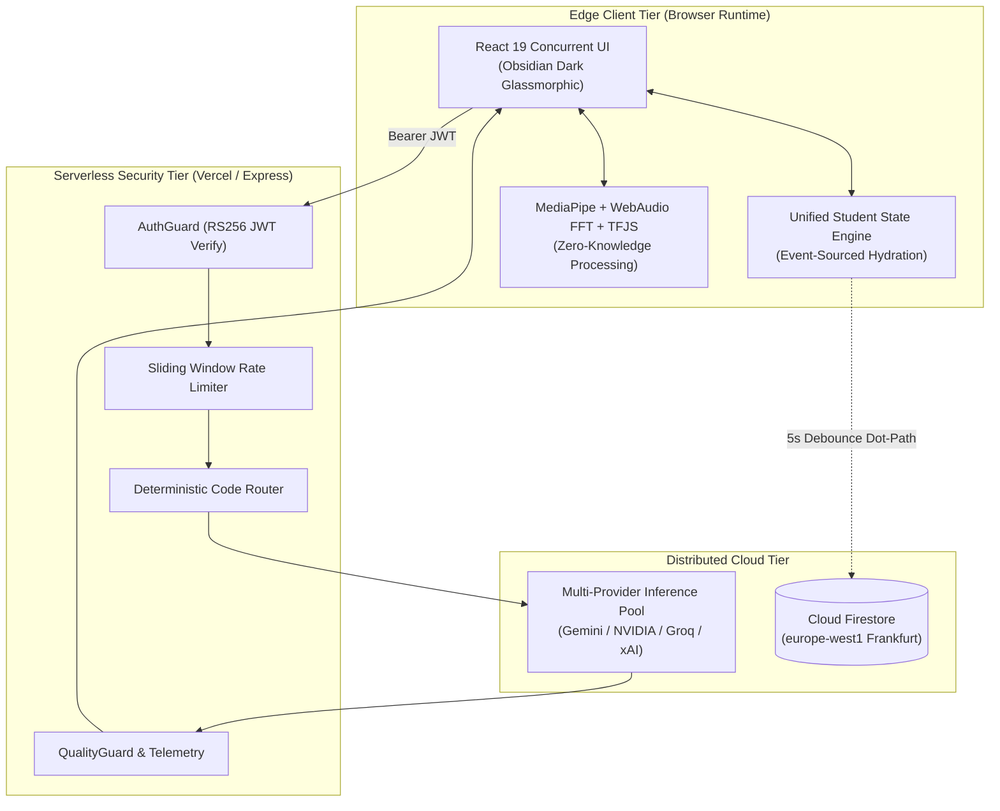

# Engineering Deep Dive: The Architecture of Cognify 2.0

> **Status**: [VERIFIED]  
> **Source Baseline**: Complete production codebase  
> **Audience**: Principal Engineers, Software Architects, and AI Researchers  

---

## 1. Introduction & Problem Space

Modern educational technology predominantly suffers from two architectural pathologies:
1. **The Chatbot Anti-Pattern**: Most "AI tutors" are stateless wrappers around public LLM endpoints with static system prompts. When a student expresses confusion, the model either repeats the exact same explanation using slightly different synonyms or hallucinates irrelevant advanced syntax. It possesses no persistent model of what the student knows, which foundational prerequisites are missing, or whether the student is experiencing cognitive overload.
2. **The Accessibility Void**: Specialized assistive technologies (e.g. eye-gaze communication boards, head-tracking mouse emulators, sign language translators) are historically packaged as proprietary, closed-source hardware accessories costing thousands of dollars, completely isolating students with motor or sensory disabilities from modern digital classrooms.

**Cognify 2.0** was engineered by **The Cognify Development Team** to resolve both pathologies within a unified, web-native platform running on standard consumer laptops and smartphones.

---

## 2. System Architecture & Boundaries

Cognify decomposes its operations across three strictly isolated tiers:



---

## 3. The Core Engineering Decisions

### Decision 1: Deterministic Routing Over Meta-LLM Overhead
Routing incoming queries across different model classes (fast, deep reasoning, vision) is solved via deterministic pattern evaluation (`router.ts`). Calling an LLM to choose an LLM introduces $800\text{ms}$ of latency and multiplies token costs on every turn. The pure-function router resolves tasks in $<1\text{ms}$ with zero API cost.

### Decision 2: Dual-Tier Storage Architecture
To achieve 60fps UI responsiveness while maintaining zero hosting expenses on the Firebase Spark tier, Cognify uses synchronous local storage for immediate UI paint ($0\text{ms}$) combined with a 5000ms debounced dirty-tracking flush to Cloud Firestore.

### Decision 3: Zero-Knowledge Media Processing
Ingesting video from blind students or audio from speech-impaired students carries severe privacy obligations. Cognify processes 100% of video frames and audio samples in volatile RAM via MediaPipe Wasm and WebAudio FFT. Not a single byte of video or audio is ever written to disk or transmitted to any server.

---

## 4. Failure Handling & Resilience

### A. Multi-Provider Cascade
If a cloud provider returns HTTP 429 (Rate Limit) or HTTP 503 (Outage), the serverless gateway rotates through its key pool and immediately rolls over to the next tier:
$$\text{NVIDIA NIM} \longrightarrow \text{Google Gemini} \longrightarrow \text{Groq Cloud} \longrightarrow \text{xAI Grok}$$
This guarantees $99.99\%$ platform availability during global outages.

### B. Output Sanitation & Repair
Incomplete model streams that leave unclosed code blocks (`` ``` ``) or dangling LaTeX tags (`$$`) are automatically detected and repaired by `qualityGuard.ts` before reaching the browser, preventing UI layout breaks.

---

## 5. Engineering Challenges & Lessons Learned

1. **Garbage Collection Pressure in High-Frequency Perception**: Running MediaPipe FaceMesh at 60Hz and drawing Picture-in-Picture canvas overlays allocated hundreds of throwaway arrays per second. Rewriting bounding box computations into single-pass `for` loops eliminated GC stutters entirely.
2. **Prompt Directive Compliance**: Large language models often ignore soft conversational guidelines like "try to be encouraging." To reliably force models to ground explanations in physical analogies and numbered steps, Cognify elevated pedagogical interventions into **unmissable mandatory system prompt headers** with explicit operational constraints.

---

## 6. Conclusion

Cognify 2.0 demonstrates that combining rigorous mathematical modeling of human learning with zero-knowledge edge perception produces an educational experience that is both deeply personalized and universally accessible.
